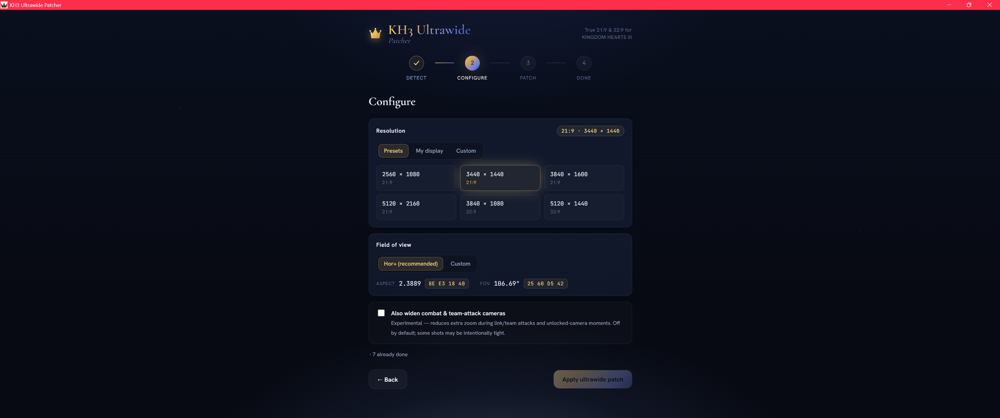
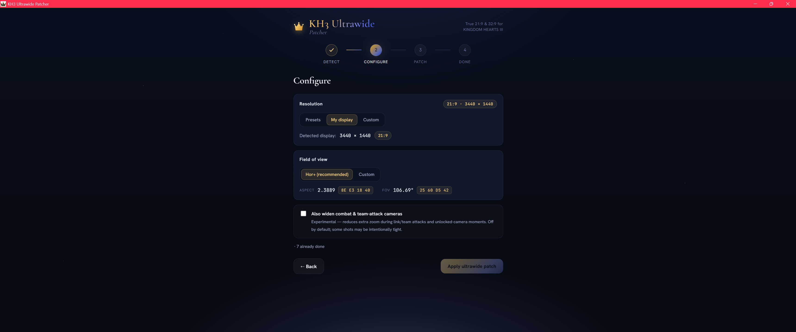
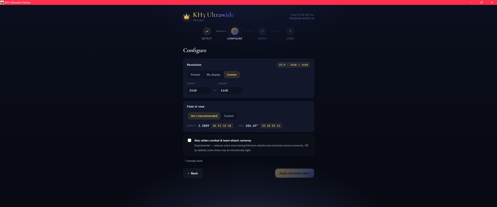

<div align="center">


<h1>KH3 Ultrawide Patcher</h1>

<p><b>True 21:9 / 32:9 ultrawide for KINGDOM HEARTS III</b> — full-width Hor+, correct proportions, no stretch or zoom.</p>

<p>
  <a href="./LICENSE"></a>
  <a href="https://github.com/LordBlacksun/kh3-ultrawide-patcher/releases/latest"></a>
  <a href="https://github.com/LordBlacksun/kh3-ultrawide-patcher/releases"></a>
  
  
</p>

</div>

A small, elegant desktop app that patches **KINGDOM HEARTS III** (Steam & Epic, Unreal
Engine 4) to render **true ultrawide** — full-width **21:9 / 32:9** with correct
proportions (**Hor+**, no stretch, no zoom) instead of pillarboxing a 16:9 image into
black bars.

It finds your install on its own, backs up the executable, applies seven 4‑byte float
edits, verifies the result, and reverts in one click.

> Built with Tauri 2 + Svelte. No telemetry, no network access — everything runs locally.

---

## Screenshots

The whole flow is three steps — **Detect → Configure → Patch**. The Configure step lets you
choose your resolution three ways, with the correct Hor+ FOV computed for you:

**Presets** — common 21:9 and 32:9 resolutions:



**My display** — auto-detect your monitor:



**Custom** — type any width × height:



---

## Features

- **Auto-detects the game** on **Steam** (registry → `libraryfolders.vdf` →
  `appmanifest_2552450.acf` → exe) and **Epic Games** (launcher manifests), with a
  **manual browse** fallback.
- **Common ultrawide presets** — 2560×1080, 3440×1440, 3840×1600, 5120×2160 (21:9),
  3840×1080, 5120×1440 (32:9) — plus **auto-detect my display** and **custom W×H**.
- **Correct math for any resolution:** aspect = `W/H`; Hor+ FOV = `2·atan((W/H)·9/16)`.
- **Safe by construction:** automatic backup (to `%LOCALAPPDATA%`), SHA-256 verification,
  idempotent re-runs, and one-click **revert** to the exact original.
- **Optional (off by default):** also widen the combat / team-attack cameras.
- **16:9-aware:** picking a 16:9 resolution is a no-op (nothing is written).

---

## How it works — the fix

KH3 has no native ultrawide; it hard-codes 16:9 in three independent places. The patch is
**seven 4-byte little-endian float overwrites** — the file size and every other byte are
unchanged. Each site is located by a unique byte signature and patched only if present
(so re-running is harmless).

| group | what | before | after (example: 3440×1440) |
|---|---|---|---|
| output / render aspect (×1) | frame fills the screen | `AC 8B E3 3F` (1.7778) | `8E E3 18 40` (2.38889) |
| camera projection aspect (×3) | correct proportions, no stretch | `3B 8E E3 3F` (1.7778) | `8E E3 18 40` (2.38889) |
| camera FOV (×3) | Hor+, no zoom | `00 00 B4 42` (90°) | `25 60 D5 42` (106.69°) |

The stored FOV is **horizontal**, so constraining the aspect to ultrawide trims the
*vertical* view unless the FOV is widened — widening it back to the angle that preserves
the original 16:9 vertical view gives true **Hor+** framing. The famous single
"`AC 8B E3 3F`" community edit is only the first group, which is why it *stretches*; the
camera aspect and FOV groups are the missing halves.

**Advanced (opt-in):** six further FOV writes cover the team/link-attack and
unlocked-camera shots, which zoom in a little more on the default 7-edit patch. They are
left at 90° by default because some may be intentionally tight; enable the checkbox to
widen them to the same Hor+ value.

---

## Install

### Option A — download (recommended once released)
Grab the latest installer or portable `.exe` from the **Releases** page, run it, and
follow the three steps: **Detect → Configure → Patch**.

### Option B — build from source
Prerequisites: [Rust](https://rustup.rs), [Node.js](https://nodejs.org) 20 or 22 (LTS), and
the WebView2 runtime (preinstalled on Windows 11).

```bash
npm install
npm run tauri dev      # run in development
npm run tauri build    # produce an installer + portable exe under src-tauri/target/release
```

---

## Verifying the download

The released `.exe` is **unsigned** (see the SmartScreen note under *Notes & known issues*), so
verify it however reassures you:

1. **Checksum** — compare your download's SHA-256 against the value published on the **Releases**
   page:
   ```powershell
   Get-FileHash .\kh3-ultrawide-patcher.exe -Algorithm SHA256
   ```
2. **VirusTotal** — each release links a VirusTotal scan; you can also upload the file yourself.
3. **Build it yourself** — clone the repo and run `./build-release.ps1` (the *Build from source*
   option above). The app makes **no network calls** and grants itself **no network permission**,
   so a from-source build does exactly what the released binary does — nothing phones home.

---

## Using it

1. **Detect** — the app locates your KH3 install and shows the executable, its state
   (clean / already patched / unknown build), and whether a backup exists.
2. **Configure** — pick a resolution preset (or your display / a custom size) and, if you
   like, a custom FOV. The default FOV is the recommended Hor+ value.
3. **Patch** — the original exe is backed up, the edits are applied, and the result is
   verified. In game, set **Borderless Fullscreen** at your chosen resolution.

**Revert** at any time restores the exact original executable from the backup.

### After a game update
Steam/Epic updates and *“Verify integrity of game files”* restore the original exe (and
thus undo the patch). Just run the patcher again — it’s idempotent and re-applies cleanly.

---

## Notes & known issues

- **Administrator:** if the game is installed under `Program Files`, Windows may require
  the patcher to run **as administrator** to write the exe. If a write is denied, relaunch
  it elevated (right-click → *Run as administrator*).
- **SmartScreen / antivirus:** the app is an unsigned executable that edits another
  executable, which can trip Windows SmartScreen or AV heuristics. It is open source and
  makes no network connections; you can build it yourself and compare hashes. Code signing —
  via the free **SignPath Foundation** program for open-source projects, which signs under the
  Foundation's name (so it doesn't expose the maintainer) — is planned. (If SmartScreen appears:
  *More info → Run anyway*.)
- **Epic Games:** Epic detection is implemented to the documented launcher-manifest format
  but was developed and verified on the Steam build — **a community tester on Epic is very
  welcome** (please open an issue with results).
- **Pre-rendered FMV cutscenes & boot/logo videos stay 16:9 (pillarboxed) — this is expected,
  not a bug.** They're native pre-rendered video files, not real-time rendering, so the patch
  can't widen them; stretching them would distort faces and logos. In-engine (real-time)
  cutscenes *do* render full ultrawide.

---

## Safety & verification

- KH3 is single-player with **no anti-cheat**, so editing the exe is safe online-wise.
- The patch **always backs up** the original first and can restore it byte-for-byte.
- The byte edits are derived from, and unit-tested against, the known build:
  - clean baseline SHA-256 `F53C398936560D543F2AA8E6283733572FDF8AD7C14E03459C12E039CB1BD0BC`
  - patched 3440×1440 (Hor+) SHA-256 `1EABCFFB09AE443521B42868E02EA126E3B346D48A859DB1021642891DA2FBBC`
- A golden test confirms the patch engine reproduces the patched build **byte-for-byte**
  from a clean baseline, and that revert restores the baseline.
- On an unrecognised build the app falls back to signature search and warns; it never
  guesses (a signature that matches more than once aborts the operation).

---

## Tech

Tauri 2 (Rust core) + SvelteKit (Svelte 5). The Rust side does all file I/O, detection,
hashing, backup, patching, and verification; the web UI is purely presentational. The app
makes **no network calls** and grants itself **no network permission** — its Tauri capability
set is just window controls and the file-open dialog (`core:default` + `dialog:allow-open`).
(Tauri's core pulls an HTTP client in transitively, but this app never configures or invokes
it; you can confirm with `cargo tree` and the capability file.)

---

## Contributing

Contributions are welcome — especially **testing on Epic Games** and reporting **new game
builds**. See [CONTRIBUTING.md](./CONTRIBUTING.md).

## Transparency

This project was **fully implemented with AI assistance, under human direction** (with in-game
testing on real hardware). See the [AI Transparency Notice](./AI-TRANSPARENCY.md).

## License

[GPL-3.0-only](./LICENSE).

---

## Disclaimer

This is an unofficial, fan-made tool, not affiliated with or endorsed by Square Enix, Disney,
Epic Games, or Valve. *KINGDOM HEARTS* is a trademark of its respective owners. It modifies
your own copy of the game executable, always backs it up first, and can revert byte-for-byte —
but you use it **at your own risk**. Full text: [DISCLAIMER.md](./DISCLAIMER.md).
